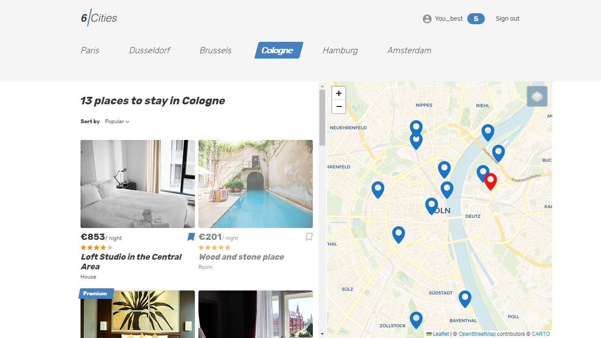

  <h1><p align='center'>:house_with_garden:<b> ПРОЕКТ 6 ГОРОДОВ </b>:hotel:</p>

</h1>

### :sunny: `Сайт бронирования отелей в красивых городах Европы:`

```
'Крупнейший город во Франции' : 'Paris'
 'Один из 3 регионов Бельгии' : 'Brussels'
        'Столица Нидерландов' : 'Amsterdam'
            'Города Германии' : 'Dusseldor Cologne Hamburg'
```
<br/>

___
### Skills
* Сделана JWT-авторизация
* Оптимизирован пользовательский интерфейс
* Добавлен OpenStreetMap для визуального представления локации арендуемой площади
* Проект покрыт тестами на JEST + React Testing Library
